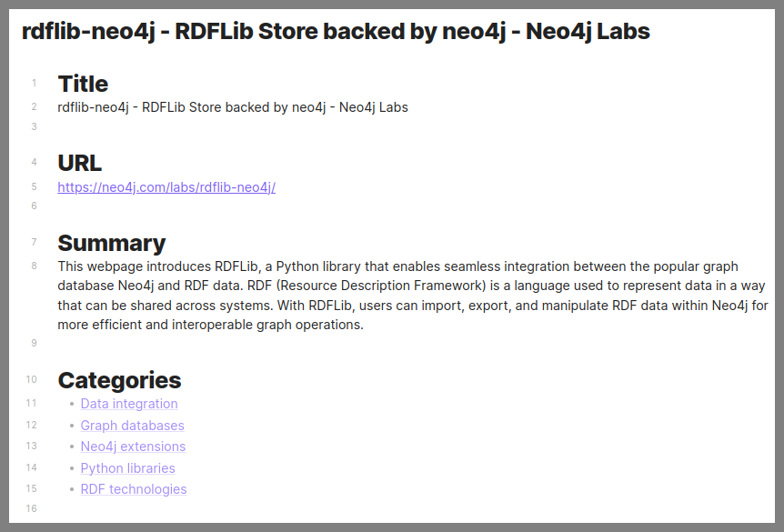
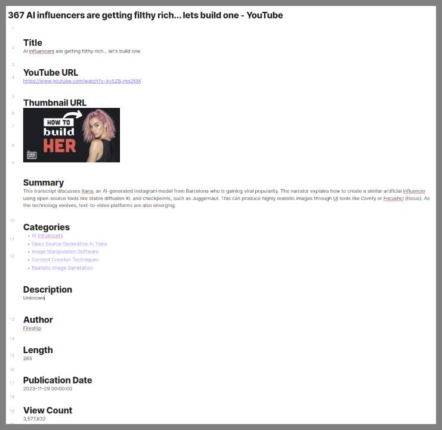

# bookish-fortnight

Generate Obsidian Pages From URLs - Eliminate Browser Bookmarks!

This project reads a bookmark file from Brave, then generates an Obsidian page for each bookmark. Ollama is used so all
processing is done locally.

The main script is `cmd-ollama-create-obsidian-page.py`. You'll need to configure the `bookmark_file` and `vault_directory`
variables before running the script.

This script was created for my own use. Therefore there is not a lot of documentation. If you need help with anything, 
please create an issue.

The script ignores URLS that contain: ['docs.google', 'reddit', 'slack', 'twitter']. Each one would require a different
approach and I did not need them. If you do, create an issue to discuss your needs or create a pull request with your 
approach.

# Example of the Generated Pages




## Youtube



# Configuration

- Install Ollama

- Download solar model. This model works well for YouTube videos.

```bash
ollama install solar
```

- Start the Ollama container.

```bash
./cmd-start-ollama-contanier.sh
```

